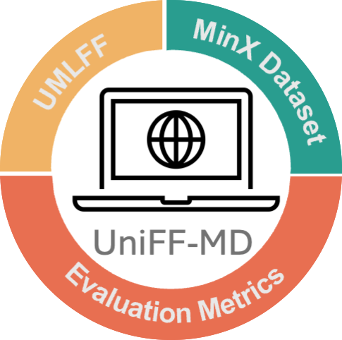

<div align="center">
<p align="center">
  
</p>


</div>

<div style="text-align: center;">
    <h1>UniFF-MD: Universal Machine Learning Force Fields Molecular Dynamics</h1>
</div>

We present a comprehensive evaluation of six state-of-the-art UMLFFs (CHGNet, M3GNet,
MACE, MatterSim, SevenNet, Orb) on a carefully curated dataset, namely
`MinX`, comprising ∼1,500 minerals with experimentally obtained crystal
structures and elastic properties. Our analysis is divided into three parts: 
-  A systematic comparison of model prediction across the minerals dataset.
-  A quantitative assessment of temporal evolution during MD simulations.
-  Evaluation of elastic constants prediction to study their efficacy of modelling mechanical properties

## Installation

- `Docker`: We provide a Dockerfile inside the `docker` that can be run to install a container using standard docker commands.
- `mamba`: We have included a `mamba` specification that provides a complete out-of-the-box installation. Run `mamba env create -n matsciml --file conda.yml`, and will install all dependencies and `matsciml` as an editable install.
- `pip`: In this case, we assume you are bringing your own virtual environment. Depending on what hardware platform you have, you can copy-paste the following commands; because the absolute mess that is modern Python packaging, these commands include the URLs for binary distributions of PyG and DGL graph backends.


## Quickstart

## MD Simulation

To run the MD simulation on the test data provided in the repository, use the following command.


```console
python  md_simulation/experiment_runner.py \
	--model_name mattersim \
	--input_dir test_data \
	--index 1 \
```

If you want to run the simulation on your own data, you must prepare it in the same format as the files in the test_data folder and replace the data path from your own data.


## **Benchmark Data and CIF Details**
The benchmark test data for UniFF-MD are available in the `test_data` folder and full data can be accessed from  [Zenodo](https://doi.org/10.5281/zenodo.16733258). Complete details of minerals name, formula and reference are provided in the folder named as `CIF_metadata` Navigate to the following to access them:

- **[test_data Folder]:** Contains sample data files used for benchmarking.
- **[CIF_metadata Folder]:** Contains details of minerals metadata used for benchmarking.


## Post processing

once you ran the simulation you can use following script for post processing. Note: Before running the script, make sure to update the root_folder path in the Python file to match the directory of the model you are analyzing. 
```console
python  post_processing/trail_post_process.py \
```

## Training folder structure
You can also use this framework to train interatomic potentials for your own structures.
The training protocol is described as:
`configs` contains the YAML configuration files used by the `matsciml` experiment parser.
At a high level, a single experiment YAML defines the scope of the experiment (e.g. task,
model, and dataset) imperatively. The experiment is then composed by passing definitions
for each component, i.e. a path to the LiPS dataset YAML file. An example call looks
like this:

```console
python matsciml/experiments/training_script.py \
	-e configs/experiments/faenet_lips_force.yaml \
	-m configs/models/faenet_pyg.yaml \
	-d configs/datasets/lips.yaml \
	-t configs/trainer.yaml
```

### Adding an experiment

1. Copy one of the experiment YAML configs; no hard and fast rule for naming scheme,
but to start off we have `<model>_<dataset>_<task>.yml` just for the ease of access.
2. Modify the keys in the experiment YAML config - the keys must match what are
defined in the other configs (e.g. `lips` refers to the name of the YAML file)
3. Update `trainer.yaml` as needed: _in particular, set the `wandb` entity to yours_!
4. Update the dataset YAML file as needed: pay attention to batch size, and paths.

### Common tweaking parameters

- Batch size (per DDP worker) is modified in the dataset YAML.
- Number of workers, epochs, callbacks are configured in `trainer.yaml`
- Learning rate is configured in the model YAML.


## Citations

If you use Open MatSci ML Toolkit in your technical work or publication, we would appreciate it if you cite the Open MatSci ML Toolkit paper in TMLR:

<details>

<summary>
Miret, S.; Lee, K. L. K.; Gonzales, C.; Nassar, M.; Spellings, M. The Open MatSci ML Toolkit: A Flexible Framework for Machine Learning in Materials Science. Transactions on Machine Learning Research, 2023.
</summary>

```bibtex
@article{openmatscimltoolkit,
  title = {The Open {{MatSci ML}} Toolkit: {{A}} Flexible Framework for Machine Learning in Materials Science},
  author = {Miret, Santiago and Lee, Kin Long Kelvin and Gonzales, Carmelo and Nassar, Marcel and Spellings, Matthew},
  year = {2023},
  journal = {Transactions on Machine Learning Research},
  issn = {2835-8856}
}
```

</details>


<details>

<summary>
Lee, K. L. K., Gonzales, C., Nassar, M., Spellings, M., Galkin, M., & Miret, S. (2023). MatSciML: A Broad, Multi-Task Benchmark for Solid-State Materials Modeling. arXiv preprint arXiv:2309.05934.
</summary>

```bibtex
@article{lee2023matsciml,
  title={MatSciML: A Broad, Multi-Task Benchmark for Solid-State Materials Modeling},
  author={Lee, Kin Long Kelvin and Gonzales, Carmelo and Nassar, Marcel and Spellings, Matthew and Galkin, Mikhail and Miret, Santiago},
  journal={arXiv preprint arXiv:2309.05934},
  year={2023}
}
```

</details>
